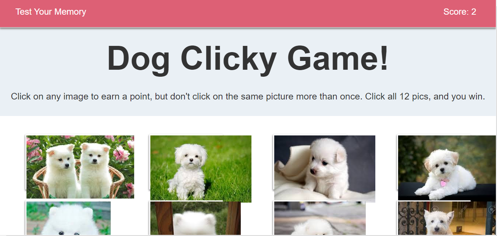

# Clicky-Game

<h1>Description</h1>

This is a memory game using React. The application's UI is split into four components.

<h3>Getting Started</h3>

https://divyagk.github.io/Clicky-Game/

<h3>Instructions</h3>

- Create a new React application using Create React App.

- The app should render 12 different images (of your choice) to the screen. Each image should listen for click events.

- The app should keep track of the user's score. The user's score should be incremented when clicking an image for the first time. The user's score should be reset to 0 if they click the same image more than once.

- Every time an image is clicked, the images rendered to the page should shuffle themselves in a random order.

- Once the user's score is reset after an incorrect guess, the game should restart.

<h3>Technologies Used:</h3>

- React

- ES6

- Bootstrap

- CSS